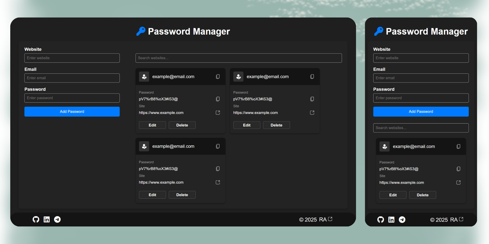

# Password Manager Project 🔐

Welcome to the **Password Manager Project**! This lightweight, user-friendly web app is designed to store and manage your passwords efficiently.
{ style="border-radius: 10px;" }
 

## Features 🎉
- **Add Passwords**: Easily save your website, email, and password information.
- **Search Functionality**: Quickly find saved credentials using the search bar.
- **Edit/Delete Entries**: Update or remove saved passwords with ease.
- **Clipboard Copy**: Copy email or password directly to your clipboard.
- **Local Storage Support**: All data is saved securely on your browser's local storage.
- **Responsive Design**: Mobile-friendly layout for seamless usage on any device.

## Technologies Used 🛠️
- **HTML5**: For structuring the app.
- **CSS3**: For styling and ensuring a modern look.
- **JavaScript**: For interactivity and functionality.

## How to Run 🏃
1. Download or clone this repository.
2. Open the `index.html` file in any web browser.
3. Start adding and managing your passwords!

## File Structure 📂
- `index.html`: Main HTML structure of the app.
- `style.css`: Contains all the styles for a sleek UI.
- `script.js`: Contains the logic for managing passwords and local storage.

## Screenshots 🖼
### Main Interface:
 <!-- Replace this with an actual screenshot -->

### Add Password Section:
 <!-- Replace this with an actual screenshot -->

## Future Enhancements 🌐
- **Password Encryption**: Adding encryption to enhance security.
- **Export/Import**: Allow users to export and import passwords as files.
- **User Authentication**: Add user authentication for added privacy.

## Credits 💖
- FontAwesome icons (✨) for amazing visuals.
- Google Fonts for typography support.

## License 🏭
This project is licensed under the [MIT License](LICENSE).

Feel free to contribute to this project and help make it better! 🎉

